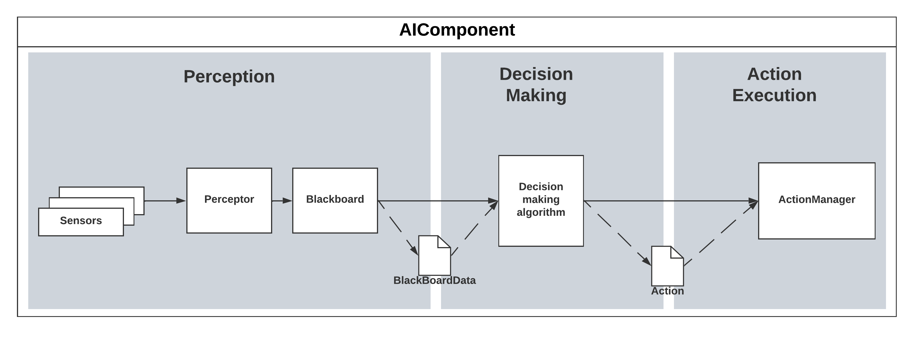

# main/game-ai-framework

## Requirements
- Dotnet 7.0+

## Architecture

## Project structure
All non-test projects posted as Nuget packages and have same naming as listed below

- [`GameAiFramework.CodeExecution`](GameAiFramework.CodeExecution/CodeExecutionREADME.md) - build AI from GUI using reflection. GUI is under development in separate repository
- `GameAiFramework.CodeExecution.Test` - unit tests for CodeExecution
- [`GameAiFramework.CoreEntities`](GameAiFramework.CoreEntities/CoreEntitiesREADME.md) - core entities of 3 layers of AI architecture
- [`GameAiFramework.DecisionMaking`](GameAiFramework.DecisionMaking/DecisionMakingREADME.md) - implementations of decision making algorithms for the framework. Currently only FSM and BT implemented
- [`GameAiFramework.Direction`](GameAiFramework.Direction/DirectionREADME.md) - AiComponent. Facade for all other AI components which is used directly in user's code
- `GameAiFramework.BehaviorTree.Test` - integration test for the BT version of framework to test its components working together and a demo of usage
- `GameAiFramework.Graph.Test` - integration test for the FSM version of framework to test its components working together and a demo of usage

## Described in detail in [this article](https://doi.org/10.20535/1560-8956.42.2023.279090)
